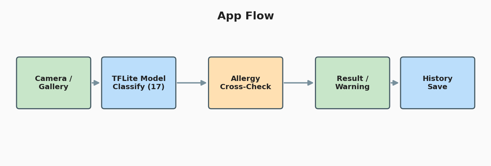
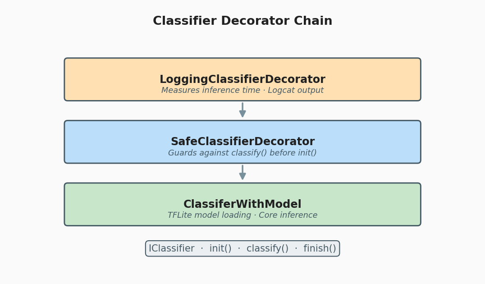
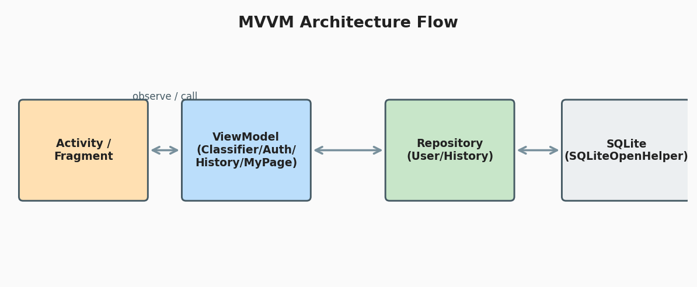
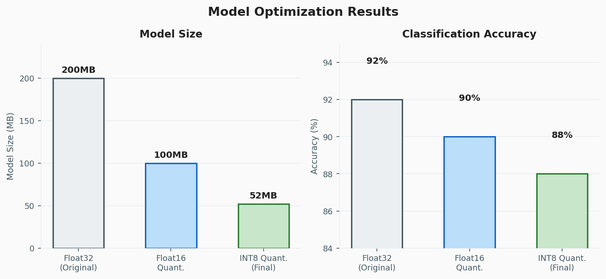
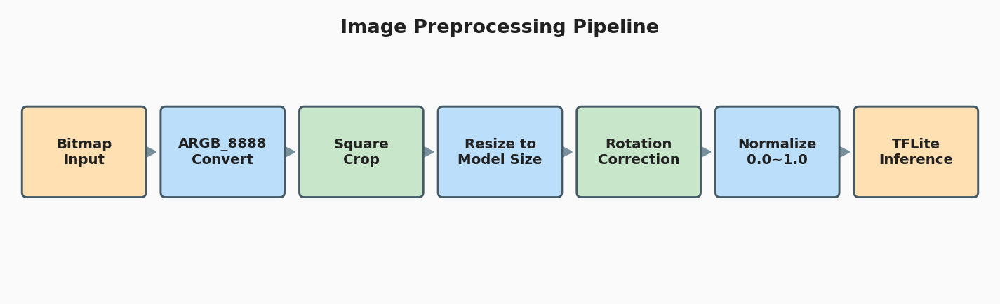

# SafeFood

> Android Snack Classifier: TFLite INT8 Quantization with Allergy Cross-Check


과자 이미지를 촬영하거나 갤러리에서 선택하면 TensorFlow Lite 모델이 17종 과자를 분류하고,
사용자가 등록한 알러지 성분(22종 기준)과 교차 검사하여 경고를 제공하는 Android 앱입니다.

INT8 양자화로 모델 크기를 **200 MB → 52 MB(약 4배 감소)**로 줄여 모바일 환경에 최적화했습니다.

---

## 목차

1. [스크린샷](#스크린샷)
2. [주요 기능](#주요-기능)
3. [기술 스택](#기술-스택)
4. [아키텍처](#아키텍처)
5. [모델 개발 과정](#모델-개발-과정)

---

## 스크린샷

| 로그인 | 메인 / 과자 분류 | 분류 결과 / 알러지 경고 | 분류 히스토리 |
|:---:|:---:|:---:|:---:|
|  |  |  |  |

---

## 주요 기능

- 카메라 촬영 / 갤러리 이미지로 과자 분류 (17종)
- 알러지 성분 교차 검사 및 경고 (`FoodAllergyDatabase` — 22종 성분 기준)
- 분류 히스토리 (사용자별 저장)
- 마이페이지 (알러지 정보 수정, 비밀번호 변경)
- 회원가입 / 로그인 / 앱 재시작 후 자동 로그인 유지
- 게스트 모드 (로그인 없이 사용, 앱 재시작 시 초기화)
- TTS 음성 안내 지원

### 분류 가능 과자 (17종)

해태 포키 블루베리, 꼬칼콘 고소한맛, 농심 매운새우깡, 콘초, 프링글스, 포테토칩, 포카칩,
빠다코코낫, 몽쉘, 야채크래커, 쁘띠첼 구미젤리, 해태 에이스, 허니버터칩, 농심 알새우칩,
예감 치즈그라탕, 쫄병, 크라운 쵸코하임



---

## 기술 스택

| 분류 | 내용 |
|---|---|
| 언어 | Java 8 (JDK 1.8) |
| 최소 SDK | API 27 (Android 8.1 Oreo) |
| 타겟 SDK | API 34 (Android 14) |
| AI / 추론 | TensorFlow Lite (`Inq1.tflite`) + ML Model Binding |
| UI | Material Design 3, AndroidX AppCompat |
| 아키텍처 | MVVM — ViewModel + LiveData (AndroidX Lifecycle 2.6.1) |
| 데이터 저장 | SQLite (SQLiteOpenHelper) — 사용자 계정, 히스토리 |
| 세션 관리 | SharedPreferences — 로그인 세션, 게스트 알러지 |
| 보안 | SHA-256 비밀번호 단방향 해싱 |
| 음성 | Android TextToSpeech (TTS) |
| 카메라 | CameraX FileProvider (사진 촬영, 갤러리 선택) |

---

## 아키텍처

### 분류기 설계 — Decorator + Factory 패턴

이미지 분류 기능을 인터페이스(`IClassifier`) 기반으로 설계하여
분류 방식이 바뀌어도 화면 코드를 수정하지 않아도 됩니다.

`ClassifierFactory`가 아래 순서로 Decorator 체인을 조립합니다.

```
ClassifierFactory.create(context)
  └── LoggingClassifierDecorator   // 분류 시간 측정 및 로그 출력
        └── SafeClassifierDecorator  // init() 호출 여부 사전 검증
              └── ClassiferWithModel   // 핵심 TFLite 추론 로직
```

| 클래스 | 역할 |
|---|---|
| `IClassifier` | 분류기 공통 인터페이스 (`init`, `classify`, `finish`) |
| `ClassiferWithModel` | TFLite 모델 로드 및 실제 추론 수행 |
| `SafeClassifierDecorator` | `init()` 없이 `classify()` 호출 시 즉시 예외 발생 |
| `LoggingClassifierDecorator` | 추론 소요 시간 측정 및 Logcat 출력 |
| `ClassifierFactory` | Decorator 체인 조립 — 구현체 교체 시 이 클래스만 수정 |



### MVVM 흐름

```
Activity / Fragment
    ↕ observe / call
  ViewModel  (ClassifierViewModel, AuthViewModel, HistoryViewModel, MyPageViewModel)
    ↕
  Repository  (UserRepository, HistoryRepository)
    ↕
  SQLite (SQLiteOpenHelper)
```



### 기술 선택 근거

**INT8 양자화 (Float16 대신):** Float16은 크기를 200 MB → 100 MB로 절반 감소, INT8은 200 MB → 52 MB로 4배 감소입니다. 정확도 손실이 각각 2%p, 4%p로 INT8이 2%p 더 크지만, 모바일 기기의 제한된 저장 공간을 고려했을 때 그 차이를 수용하고 최대 경량화를 선택했습니다.

**Decorator 패턴 (단일 클래스 대신):** TFLite 모델이 교체되더라도 Activity 코드를 수정하지 않고 `ClassifierFactory`만 변경하면 됩니다. 로깅과 초기화 검증 로직이 핵심 추론 코드와 분리되어 각 책임이 독립적으로 유지됩니다.

---

## 모델 개발 과정

### 실험한 모델

| 파일 | 설명 |
|---|---|
| `model.tflite` | 초기 실험 모델 |
| `model2.tflite` | 구조 변경 실험 |
| `modelM.tflite` | MobileNet 기반 실험 |
| `Inception1.tflite` | InceptionV3 기반 실험 |
| `model_quant_f16.tflite` | Float16 양자화 실험 |
| `Inq1.tflite` | **최종 채택 — INT8 양자화** |

### 최적화 결과

| 항목 | 원본 모델 | 최종 모델 (`Inq1.tflite`) |
|---|---|---|
| 모델 크기 | 200 MB | 52 MB |
| 분류 정확도 | 92% | 88% |
| 크기 감소 | — | 약 4배 감소 |
| 정확도 하락 | — | 4% 하락 |

용량을 4배 줄이면서 정확도 하락은 4%에 그쳤습니다.



### 이미지 전처리 파이프라인

`ImageProcessor`를 통해 추론 전 전처리를 순서대로 적용합니다.

```
Bitmap 입력
  → ARGB_8888 변환 (포맷 통일)
  → 짧은 변 기준 정사각형 크롭 (ResizeWithCropOrPadOp)
  → 모델 입력 크기로 리사이즈 (ResizeOp, NEAREST_NEIGHBOR)
  → 카메라 센서 방향 보정 회전 (Rot90Op)
  → 픽셀값 정규화 0.0 ~ 1.0 (NormalizeOp)
  → TFLite 추론
```



---

